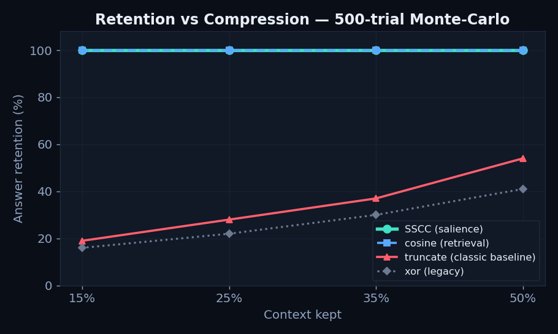
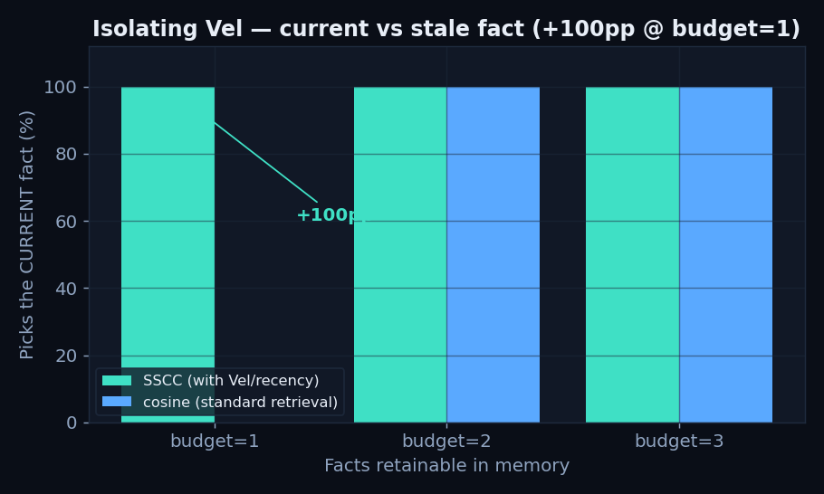
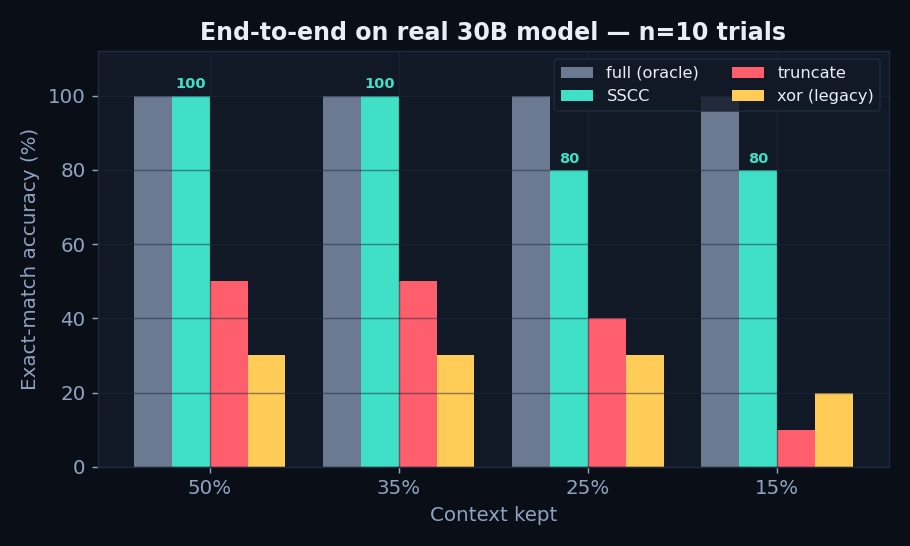
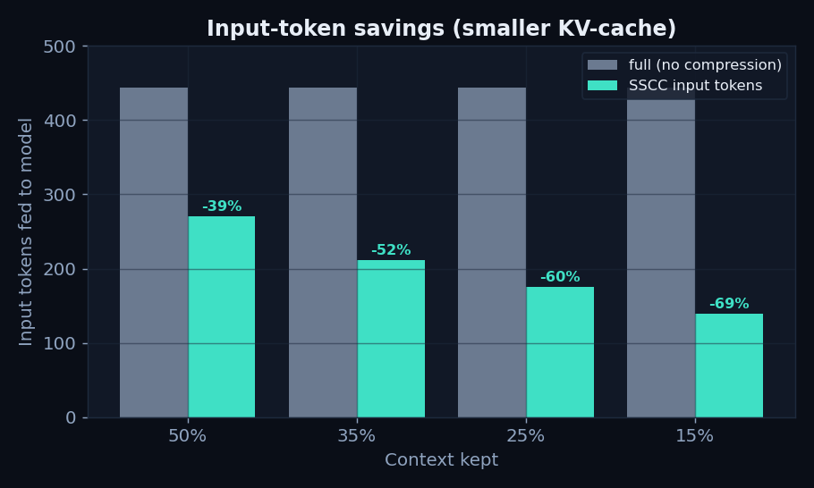
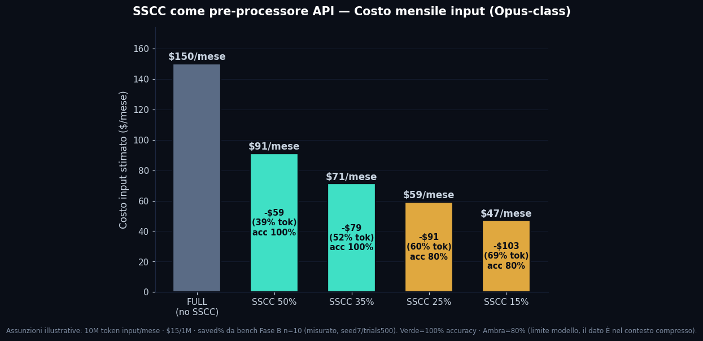

# LLM-Hybrid-Offload-Engine 🌌


A plug-and-play engine for running large (30B+) language models locally by
**offloading inference between CPU and GPU**, plus **SSCC** — a salience-driven
context-compression module that keeps the answer while cutting input tokens.

Everything is **100% on-premise**, honest about its numbers, and reproducible
from a single script.

> 📊 **Visual report:** open [`stat.html`](stat.html) in any browser for the full
> interactive dashboard — throughput, accuracy, retention and API-cost charts,
> with the narrative and the honest caveats in one page.

---

## 1. The Problem

Two distinct walls when running a 30B+ model on a workstation:

1. **Memory-bandwidth wall.** A pure-RAM run is bottlenecked by the DDR5 bus
   (~90 GB/s). The CPU spends most of its time waiting for weights, not computing.
2. **Context / KV-cache wall.** Long prompts blow up the KV-cache (an f16 KV-cache
   for a 1M-token context can exceed 190 GiB). Naive truncation to fit the budget
   silently throws away the part of the context you needed.

This engine addresses **both**: hybrid layer offload for the first, **SSCC** for the second.

---

## 2. Hybrid Offload

By splitting model layers between GPU VRAM and CPU RAM and using a physical-core
thread count, the engine runs heavy models at fluid speed on a single consumer GPU.

**Standard (pure RAM):** `RAM (DDR5) -> CPU (bottleneck) -> wait -> output`

**Hybrid:** `Input -> physical-core threads (CPU) || CUDA layers (GPU) -> output`

<p align="center">
  
</p>

### Benchmarks (measured, not theoretical)

Test rig: AMD Ryzen 7 7700X (8C/16T) - 64 GB DDR5 - RTX 5060 Ti 16 GB
Model: Nemotron-Cascade-2 30B-A3B Q8_0 (31.3 GiB)

| Hardware Config | Threads | Offload | Decode Tokens/sec |
| :--- | :--- | :--- | :--- |
| CPU Only (pure RAM) | 8 (physical) | 0 GPU layers | **11.80 t/s** |
| CPU Only (SMT on)   | 16 (logical) | 0 GPU layers | 8.24 t/s (-30%) |
| **Hybrid Offload**  | 8 (physical) | 25 GPU layers | **21.80 t/s (+85%)** |

**Reading the results:**
- The SMT row exposes the context-switching penalty: *more logical threads is
  slower*, because physical cores contend for the same execution units. We
  therefore cap threads to the physical-core count (`n_threads = 8`).
- Hybrid offload nearly doubles CPU-only throughput.
- We deliberately report the real CPU-only number (11.80 t/s), not a scary
  "< 2 t/s" figure — honest numbers only.

---

## 3. SSCC — Soliton-Salience Context Compression

Context pruning **must be semantic**. SSCC scores every context chunk by a
salience function and keeps only what fits a token budget, ordered to preserve the answer.

### The salience score

SSCC reuses the **Universal Topological Resonance Equation** (Vicari, 2026) as the
salience measure — an engineering application of a *previously published* result,
not a new physical claim:

```
score = cos * (1 + a*Amp) * (g + (1-g)*Vel) * (1 + b*mood)
```

| Term | Meaning | Default |
| :--- | :--- | :--- |
| `cos`  | cosine relevance query <-> chunk | — |
| `Amp`  | solitonic amplitude (salience) | a = 0.35 |
| `Vel`  | **recency / velocity** — favors the *current* fact over the stale one | g = 0.70 |
| `mood` | affective (VAD) modulation | b = 1.20 |

The differentiating term is **`Vel` (recency)**: no standard retrieval scorer
(cosine, LLMLingua, SnapKV) can distinguish a fact that was later updated. SSCC can.

### 3.1 Retention vs Compression — 500-trial Monte-Carlo (numpy, no model)

Hide the answer among 30 homogeneous distractors, compress to a target ratio,
check whether the needle survives.

<p align="center"></p>

| Context kept | SSCC | cosine | truncate (classic) | xor (legacy) |
| :--- | :--- | :--- | :--- | :--- |
| 50% | **100%** | 100% | 54% | 41% |
| 35% | **100%** | 100% | 37% | 30% |
| 25% | **100%** | 100% | 28% | 22% |
| 15% | **100%** | 100% | **19%** | 16% |

At -85% context the naive baseline collapses to 19%; SSCC keeps 100%.

### 3.2 Isolating Vel (recency)

Two codes in memory (an old one + the current one), budget = 1 fact:

<p align="center"></p>

| Facts retainable | SSCC (with Vel) | cosine (standard retrieval) |
| :--- | :--- | :--- |
| 1 | **100%** | **0%** |
| 2 | 100% | 100% |
| 3 | 100% | 100% |

At budget = 1, recency gives **+100 pp** over pure semantic retrieval.

### 3.3 End-to-end on the real model — n=10, exact-match

Nemotron-Cascade-2 30B-A3B Q8 - ctx 32768 - 25 GPU layers - load 2.9s -
secret = `ZX-4471-DELTA`.

<p align="center"></p>
<p align="center"></p>

| Context kept | Method | Accuracy | Input tok | Tokens saved | Decode t/s |
| :--- | :--- | :--- | :--- | :--- | :--- |
| 50% | full (oracle) | 100% | 444 | — | 25.2 |
| 50% | **SSCC** | **100%** | 270 | -39.3% | 25.1 |
| 50% | truncate | 50% | 262 | -41.0% | 25.3 |
| 50% | xor (legacy) | 30% | 259 | -41.7% | 25.3 |
| 35% | **SSCC** | **100%** | 211 | -52.5% | 25.5 |
| 35% | truncate | 50% | 204 | -54.2% | 25.4 |
| 25% | **SSCC** | **80%** | 175 | -60.5% | 25.4 |
| 25% | truncate | 40% | 168 | -62.2% | 25.0 |
| 15% | **SSCC** | **80%** | 139 | -68.6% | 25.5 |
| 15% | truncate | **10%** | 131 | -70.5% | 25.5 |
| 15% | xor (legacy) | 20% | 130 | -70.7% | 25.0 |

**Bottom line:** SSCC saves up to **~69% of input tokens** while keeping the
answer, whereas the classic truncation baseline drops to 10% at aggressive
compression. Fewer input tokens => smaller KV-cache => longer effective context
at the same VRAM.

> **On the 80% at 25%/15%:** at these aggressive ratios exact-match dips to 80%
> (8/10) — but the 500-trial *retention* above is **100%**, i.e. the needle **is
> present** in the compressed context. The 20% miss is the **model** failing to
> extract from a very short prompt, **not** SSCC dropping the needle.

### Technical honesty
- On a **single homogeneous needle**, `Amp` adds little over plain cosine (both
  find it). The measured gains come from **retention + recency (Vel) + token savings**.
- **Decode throughput does not improve** on these short-context tasks — the win is
  *tokens / KV-cache*, not raw speed. We do not claim otherwise.
- SSCC is a **no-op** (honest pass-through) when the target ratio >= 1.0.
- The former legacy bit-filter (`xor`) was **not repaired**: it was **replaced**
  by this semantically-grounded method. It is kept in the benchmark only as a
  negative control (it collapses like a biased coin).

---

## 4. Requirements

| Component | Requirement | Notes |
| :--- | :--- | :--- |
| NVIDIA Driver | CUDA >= 12.4 | `nvidia-smi` must work |
| CUDA Toolkit | 12.4 (`nvcc`) | Only for building from source |
| Host Compiler | `gcc-13` / `g++-13` | CUDA 12.4 does **not** support GCC >= 14 |
| Python | 3.10 - 3.14 | Prebuilt wheels 3.10-3.13 - 3.14 -> source build |

> ⚠️ Prebuilt wheels are not available for Python 3.14. On 3.14 the installer
> compiles from source (handled automatically by `install.sh`).

> ℹ️ **No GPU?** `install.sh` still completes (CPU-only fallback), but the
> benchmark **stops on purpose** at the GPU preflight check — it never runs a
> "fake" CPU benchmark labeled as *hybrid*. We never lie about the numbers.

---

## 5. Installation (Plug & Play)

```bash
git clone https://github.com/Soliton0382/LLM-Hybrid-Offload-Engine.git
cd LLM-Hybrid-Offload-Engine
chmod +x install.sh && ./install.sh
source .venv/bin/activate
```

Then:
1. Place your `.gguf` model in `models/`.
2. Copy `template.env` to `.env` and set `MODEL_NAME`, `GPU_LAYERS`, `CONTEXT_WINDOW`.
3. Run the **inference throughput** benchmark (CPU vs SMT vs Hybrid):
   - Automated 3-mode comparison: `python3 bench/hybrid_offload_benchmark.py --auto`
   - Interactive chat + live telemetry: `python3 bench/hybrid_offload_benchmark.py`
4. Run the SSCC benchmark:
   - Phase A only (retention, numpy, no model): `./run_benchmark.sh`
   - Phase A + Phase B (real GGUF answer + tokens + VRAM): `./run_benchmark.sh --model`

Verify the GPU build at any time:
```bash
python -c "import llama_cpp; print('GPU:', llama_cpp.llama_supports_gpu_offload())"
# -> GPU: True
```

---

## 6. Environment Flags

Configure in `.env`:

| Variable | Default | Purpose |
| :--- | :--- | :--- |
| `MODEL_NAME` | (nemotron) | GGUF filename in `models/` |
| `GPU_LAYERS` | 25 | Layers offloaded to GPU (Hybrid mode) |
| `CONTEXT_WINDOW` | 32768 | KV-cache context size |
| `SHOW_LLAMA_LOGS` | 0 | Set to 1 to print raw llama.cpp logs (debug) |
| `SSCC_ENABLE` | 0 | Enable Soliton-Salience Context Compression |
| `SSCC_BUDGET_CHARS` | 1600 | Character budget SSCC compresses the context to |
| `SSCC_MIN_KEEP` | 3 | Minimum number of chunks always kept |

---

## 7. Troubleshooting

<details open>
<summary><b>ninja: build stopped: subcommand failed (during install)</b></summary><br>
Your system GCC is too new for CUDA 12.4 (supports GCC <= 13). Force the host compiler:

```bash
CC=gcc-13 CXX=g++-13 \
CMAKE_ARGS="-DGGML_CUDA=on -DCMAKE_CUDA_HOST_COMPILER=/usr/bin/g++-13" \
pip install --force-reinstall --no-cache-dir llama-cpp-python
```
If gcc-13 is missing: `sudo apt install gcc-13 g++-13`
</details>

<details>
<summary><b>The model runs but VRAM stays empty / tokens/s are low</b></summary><br>
Your llama-cpp-python is a CPU-only build. Verify:

```bash
python -c "import llama_cpp; print(llama_cpp.llama_supports_gpu_offload())"
```
If it prints `False`, reinstall using the CUDA method above.
</details>

<details>
<summary><b>Output flooded with CUDA Graph reused</b></summary><br>
That spam is normal GPU activity but buries the output; the bundled benchmark
filters it automatically. To inspect raw logs: `SHOW_LLAMA_LOGS=1 ./run_benchmark.sh --model`
</details>

<details>
<summary><b>Driver shows CUDA 13.x but nvcc says 12.4</b></summary><br>
Expected: `nvidia-smi` reports the max CUDA the driver supports; `nvcc` reports
the installed toolkit. The driver is backward-compatible, so the cu124 build works.
</details>

---

## 8. Theoretical Foundation

The SSCC salience score is an engineering application of the
**Universal Topological Resonance Equation**:

> Vicari, F. — *"Universal Topological Resonance Equation: Experimental
> Verification and Impact on Spacetime Metric Engineering"* (2026).

SSCC does not introduce a new physical claim; it **reuses** the published
topological formalism (amplitude / velocity terms) as a computational salience
measure for context selection.

---

## License

MIT — see the `LICENSE` file.


## 9. Modalità API — SSCC come pre-processore (doppio prodotto)

SSCC non serve solo in locale. Poiché la compressione a salienza avviene **client-side, a monte** della chiamata al modello, funziona con **qualsiasi provider a pagamento** (Opus, GPT, ecc.), che fatturano **a token di input**.

```
[RAG / cronologia / documenti]
          │
          ▼
   SSCC (locale, quasi gratis)  ──►  taglia 40–70% dei token salienti
          │
          ▼
   API costosa (Opus / GPT)     ──►  fattura SOLO sul contesto rimasto
```

**La stessa formula, due modalità di risparmio:**

| Modalità | Dove gira SSCC | Cosa risparmia | Vantaggio |
|---|---|---|---|
| **Locale** (Hybrid Offload) | in-process | VRAM / KV-cache | +contesto per GB, zero cloud, sovranità dato |
| **API** (pre-processore) | client-side | token di input fatturati | −40÷70% bolletta input, provider-agnostico |

**Stima costo input** (assunzioni illustrative: 10M token/mese, $15/1M):



| Modalità | Token risparmiati | Costo/mese | Accuracy |
|---|---|---|---|
| FULL | — | $150 | 100% |
| SSCC 50% | −39.3% | $91 | 100% |
| SSCC 35% | −52.5% | **$71** | **100%** |
| SSCC 25% | −60.5% | $59 | 80%* |
| SSCC 15% | −68.6% | $47 | 80%* |

\* L'80% a 25/15% è **limite del modello di generazione** (la retention a 500 trial resta 100%: l'informazione È nel contesto compresso), non una perdita di SSCC.

**Caveat onesto:** per calcolare la salienza serve un *embedder* per il coseno. Due strade: (a) un modello locale di embedding — costo ≈ zero, consigliato; (b) l'endpoint `/embeddings` del provider — costo minimo, molto inferiore ai token di generazione. In entrambi i casi il risparmio netto sull'input resta ampio. Non è gratis-gratis: è **quasi**-gratis.

Riferimento implementativo provider-agnostico: `sscc_api_client.py` (try it offline: `python3 sscc_api_client.py --demo`).
